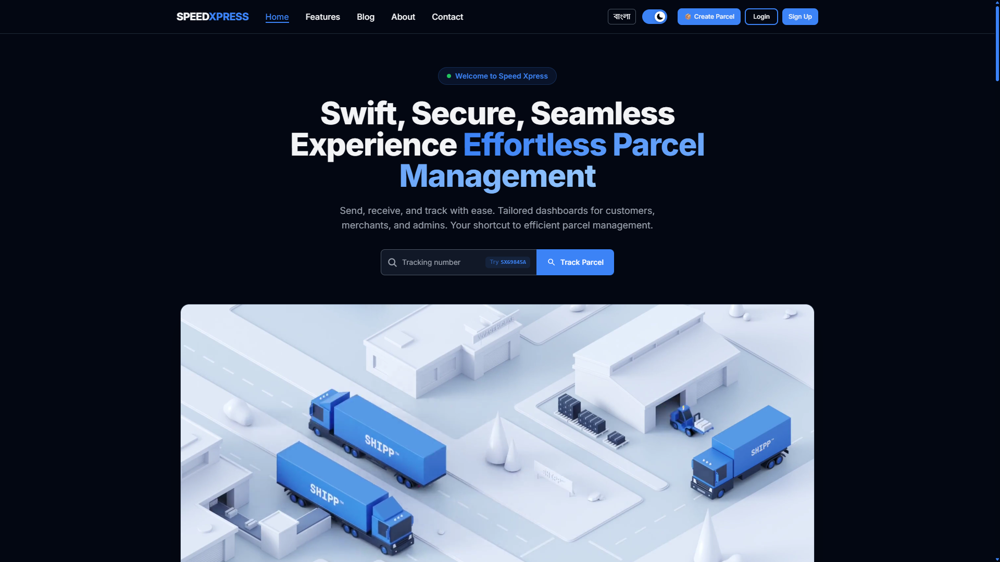

<div align="center">
  <h1>🚀 Speed Xpress — Frontend</h1>
  <p><strong>Swift · Secure · Seamless</strong></p>
  <p>A full-featured courier & parcel management platform.<br>Built with <strong>Next.js 14</strong> + <strong>TypeScript</strong> + <strong>Firebase Auth</strong> + <strong>Stripe</strong>.</p>

  <p>
    <a href="https://speedxpress.vercel.app" target="_blank">🌐 Live Demo</a>
    ·
    <a href="#features">✨ Features</a>
    ·
    <a href="#tech-stack">🛠️ Stack</a>
    ·
    <a href="#structure">📁 Structure</a>
    ·
    <a href="#setup">🚀 Setup</a>
  </p>

  <p>
    
    
    
    
    
    
  </p>
</div>



---

## 📋 Overview

Speed Xpress is a **production-grade courier management system** with **4 role-based dashboards** — Admin, Merchant, Rider, and Regular Customer. It supports guest parcel creation (no login), real-time tracking, Stripe payments, bilingual i18n (English + Bengali), and analytics with Chart.js.

> Perfect for last-mile delivery, e-commerce logistics, and courier companies.

---

## ✨ Features

### 🌐 Public (No Login)

| Feature | Description |
|---|---|
| **Landing Page** | Animated hero, pricing calculator, partner logos (Daraz, Pathao, RedX, Paperfly, Ajkerdeal), FAQ, testimonials |
| **Pricing Calculator** | Select weight/zone/shipping → real-time cost breakdown |
| **Guest Parcel** | Create a parcel without signing up |
| **Parcel Tracking** | Track by ID with visual status timeline & PDF download |
| **Blog** | Logistics & shipping articles |
| **i18n** | Full **English** + **Bengali (বাংলা)** |

### 🔐 Role Dashboards

| Role | Key Capabilities |
|---|---|
| **👤 Regular** | Create/track parcels, invoices, Stripe/COD payments, profile |
| **🏪 Merchant** | All regular features + **shop management** (multiple shops) |
| **🏍️ Rider** | View deliveries, update status, earnings tracking |
| **⚙️ Admin** | Full control — users, merchants, riders, all parcels & invoices |

### 📊 Analytics (Per Role)
Parcel stats, invoice stats, Chart.js line chart (parcels over time), pie chart (status distribution).

### 💳 Payments
Stripe Checkout, Cash on Delivery, invoice PDF download via react-to-print.

### 🎨 UI/UX
Dark mode by default (next-themes), Framer Motion animations, fully responsive (mobile-first), NextUI v2, react-toastify notifications.

---

## 🛠️ Tech Stack

| Category | Technology |
|---|---|
| **Framework** | Next.js 14 (App Router) |
| **Language** | TypeScript 5 |
| **Styling** | Tailwind CSS 3.4 + NextUI v2.2 |
| **Animation** | Framer Motion 10 |
| **Auth** | Firebase Auth (Email + Google) |
| **Payments** | Stripe Checkout Sessions |
| **HTTP** | Axios (401 auto-logout interceptor) |
| **Server State** | TanStack React Query 5 |
| **Forms** | react-hook-form |
| **Charts** | Chart.js 4 + react-chartjs-2 |
| **Theme** | next-themes (data-theme) |
| **i18n** | Custom EN / BN dictionaries |
| **Carousel** | Embla Carousel |
| **PDF** | react-to-print |
| **JWT** | jose (httpOnly cookie) |

---

## 📁 Structure

```
src/
├── app/
│   ├── (primary)/           # Public routes
│   │   ├── page.tsx         # Home
│   │   ├── (auth)/          # Login, Register, Password
│   │   ├── parcels/[id]/    # Tracking
│   │   ├── create-parcel/   # Guest
│   │   └── ...              # About, Blog, Contact, Features
│   └── dashboard/
│       ├── admin/     (12 pages)
│       ├── merchant/  (8 pages)
│       ├── regular/   (7 pages)
│       └── rider/     (7 pages)
├── components/        # Home, Dashboard, Login, Register, GuestParcel
├── hooks/             # 15+ custom hooks (React Query, auth, table controls)
├── lib/i18n/          # en.ts + bn.ts
├── providers/         # Auth, Theme, Query, AllState
├── types/             # 16+ type definitions
├── ui/                # CustomInput, SelectDivision, etc.
├── utils/api/         # API clients (parcel, invoice, user, shop, payment)
├── config/            # Firebase init
└── data/              # Divisions, districts, blog, reviews, navbar
```

---

## 🚀 Setup

```bash
git clone https://github.com/devabutaher/speed-xpress
cd speed-xpress
npm install
npm run dev     # → http://localhost:3000
```

### Environment Variables

```env
NEXT_PUBLIC_FIREBASE_apiKey=...
NEXT_PUBLIC_FIREBASE_authDomain=...
NEXT_PUBLIC_FIREBASE_projectId=...
NEXT_PUBLIC_FIREBASE_storageBucket=...
NEXT_PUBLIC_FIREBASE_messagingSenderId=...
NEXT_PUBLIC_FIREBASE_appId=...
NEXT_PUBLIC_STRIPE_PUBLISHABLE_KEY=pk_test_...
NEXT_PUBLIC_JWT_SECRET=...
NEXT_PUBLIC_SERVER_URL=http://localhost:5001/api
NEXT_PUBLIC_CLIENT_URL=http://localhost:3000
```

---

## 🔌 API Endpoints

All calls → `NEXT_PUBLIC_SERVER_URL`. Response format: `{ code, data, message }`.

| Module | Base | Key Endpoints |
|---|---|---|
| **Parcels** | `/parcels` | `GET all-parcel`, `GET ?email=`, `GET /:id`, `POST create-parcel`, `PUT update/:id`, `PUT update-status/:id`, `DELETE /:id` |
| **Users** | `/users` | `GET all-users`, `GET ?email=`, `GET /:id`, `POST create-user`, `PUT update-user/:id`, `DELETE /:id` |
| **Shops** | `/shops` | `GET all-shop`, `GET ?email=`, `GET /:id`, `POST create-shop`, `PUT update-shop/:id`, `DELETE /:id` |
| **Payment** | `/payment` | `POST /` (Stripe), `POST create-invoice`, `GET all-invoices`, `GET invoice/?email=`, `GET invoice/:id`, `PUT update-status/:id`, `DELETE /:id` |

---

## 🧪 Demo

- **Guest parcel** — Create from homepage (no login)
- **Track parcel** — Use ID `SXE8B97B` on the tracking widget
- **Full dashboard** — Register at `/register` (pick any role)

---

## 👨‍💻 Authors

| Name | GitHub |
|---|---|
| **Abu Taher** | [@devabutaher](https://github.com/devabutaher) |
| **Tofayel** | [@Tofayel-stack](https://github.com/Tofayel-stack) |
| **Ashikur Rahman** | [@ashikur540](https://github.com/ashikur540) |
| **Anas Mahmud** | [@anas-mahmud](https://github.com/anas-mahmud) |

---

## 📬 Feedback

**code.abutaher@gmail.com**

---

## 📜 License

[MIT](https://choosealicense.com/licenses/mit/)
